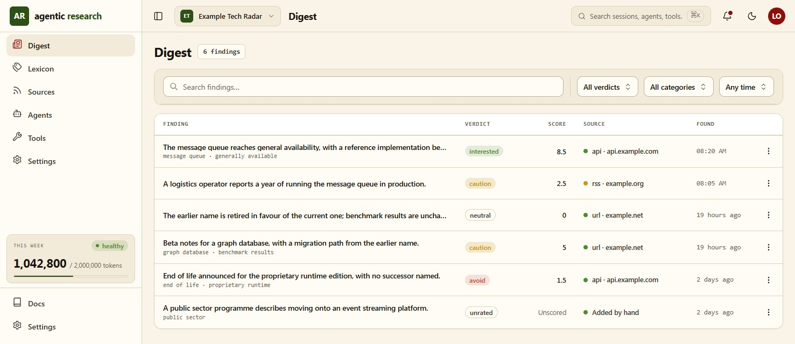
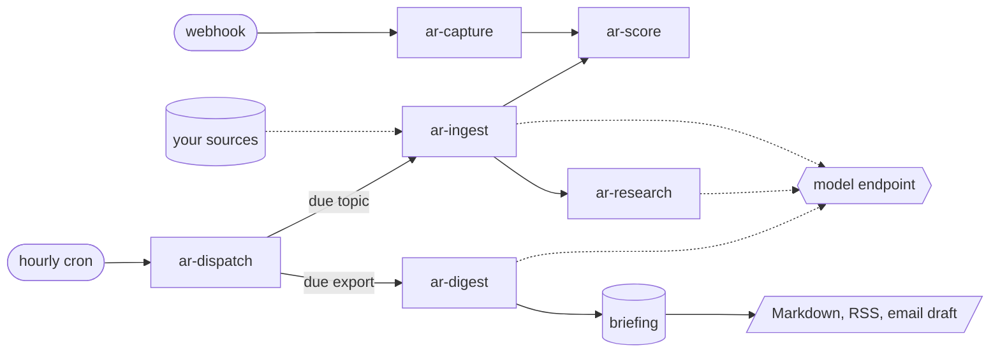
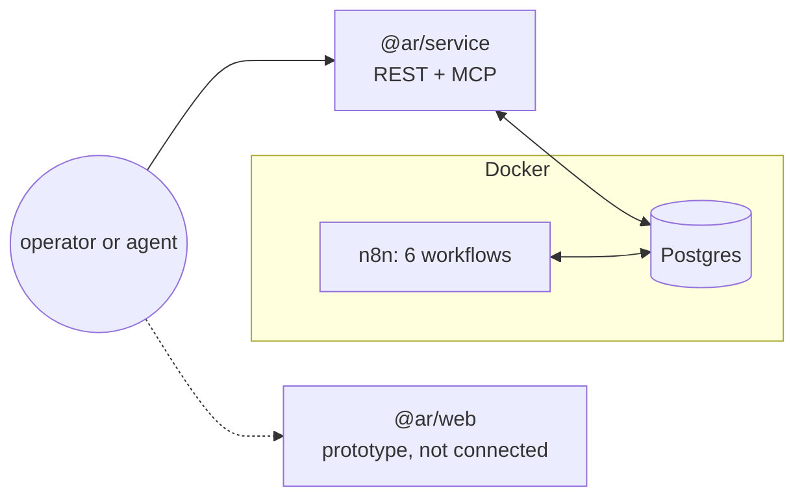

<p align="center">

[](https://github.com/marcostomatti/template-agentic-research/actions/workflows/back.yml)
[](LICENSE)
[](https://github.com/marcostomatti/template-agentic-research/tags)
[](https://bun.sh)

</p>

<h1 align="center"></h1>

<p align="center">
  <strong>Point it at a field. Get a briefing.</strong><br>
  A self-hosted agentic research pipeline: your sources in, scored findings and periodic digests out.
</p>


## What is it

**agentic-research** is a research pipeline that automates keeping up with a
field. You describe a domain (its categories, terms, personas and topics),
point it at sources, and it ingests, scores and digests what they publish on
a schedule.

Following a field means reading dozens of feeds and discarding most of them.
Model agents can triage that reading, but left unattended they drift and burn
budget. Here Postgres holds all state, n8n workflows claim only the work that
is due, scoring is deterministic, and a human approves anything an agent
proposes.

- **Domain taxonomy**: domains, categories, terms, personas and topics, seeded from files and edited over the API.
- **Scheduled pipeline** on n8n: ingest, score, research and digest, driven by one dispatcher.
- **Human approval gates** for research candidates and model-proposed parser configs.
- **REST + MCP** from one service, backed by the same functions, with an OpenAPI 3.1 document.
- **Exports** to Obsidian or Notion Markdown, RSS, or email drafts.

## Prerequisites

- **macOS or Linux** (Windows through WSL2). The setup scripts are bash.
- **[Bun](https://bun.sh) 1.3.9**, plus Node.js ≥ 22 for a few tooling scripts.
- **Docker** with Compose v2, which runs Postgres 16 and n8n 2.15.1.
- **An OpenAI-compatible model endpoint and API key**, either hosted or local (Ollama, LM Studio, vLLM). Only pipeline passes need it; the web app and test suites run without one.

> [!NOTE]
> We use Bun for everything: install, scripts, the service and the tests.
> npm, pnpm and yarn are not supported, because the workspace protocol and
> `bun.lock` are Bun's. The local stack itself is covered in more depth in
> [packages/service/context/local-stack.md](packages/service/context/local-stack.md).

## Installation

```bash
git clone https://github.com/marcostomatti/template-agentic-research.git agentic-research
cd agentic-research
bun install
```

```bash
cp packages/service/.env.example packages/service/.env
# Then set the model settings in packages/service/.env:
#   AR_LLM_ENDPOINT=<OpenAI-compatible base URL>   # local model: http://host.docker.internal:<port>/v1
#   AR_LLM_MODEL=<model name>
#   AR_LLM_API_KEY=<key>
```

> [!WARNING]
> **Start with a low spend limit on the key you put in `AR_LLM_API_KEY`.**
> Once `bootstrap.sh` has run, n8n fires `ar-dispatch` every hour with nobody
> watching, and every due topic, research candidate and digest costs model
> calls. Cap the key at your provider until you have tuned topic intervals,
> sources, `maxAgentReschedules` and the dispatch cron, and have watched a few
> passes in `GET /spend/summary`. "Low" depends on your domain, sources and
> model. The point is to catch a loop or a bad setting while it is still
> cheap. `packages/service/scripts/panic.sh` disarms every workflow and stops the stack. You are
> responsible for your deployment's spend
> (see [Contributing & License](#contributing--license)).

```bash
cd packages/service
scripts/bootstrap.sh   # Postgres + n8n up, migrations, workflows imported, armed and registered
```

## Quickstart

Seed the worked example domain and start the API. Auth stays off until you set
`AUTH_BASIC_USER` and `AUTH_BASIC_PASSWORD`, so the calls below need no token.

```bash
cd packages/service
bun run db:seed   # creates the example domain "example-tech-radar"
bun run dev       # REST API on http://localhost:3000 (keep it running)
```

In a second terminal, give the domain a source and bring a seeded topic due.
Seeded topics start unscheduled, and `run-now` is what schedules one.

```bash
API=http://localhost:3000

# 1. A source: a public JSON listing, with the path to each field
curl -X POST $API/domains/example-tech-radar/sources \
  -H 'Content-Type: application/json' \
  -d '{"kind":"api","endpoint":"https://hn.algolia.com/api/v1/search_by_date?tags=story&query=llm",
       "parserConfig":{"recordsPath":"hits","fields":{"title":{"path":"title"},"url":{"path":"url"},"publishedAt":{"path":"created_at"}}}}'

# 2. Bring a topic due (copy an id from the list)
curl $API/domains/example-tech-radar/topics
curl -X POST $API/topics/<TOPIC_ID>/run-now

# 3. After the pass: what ran, and what it found
curl $API/runs
curl $API/domains/example-tech-radar/findings
```

To run the pass, open n8n at <http://localhost:5678>, open `ar-dispatch`, and
click **Execute workflow**. You can also wait for the next hourly tick.
Before trusting any results, replace the seeded researcher persona, which is a
placeholder: until it asks for JSON, findings stay empty (see
[Troubleshooting](#troubleshooting--known-issues)). Exports, auth and the full
end-to-end check are in the
[CHECKPOINT 2 runbook](packages/service/docs/CHECKPOINT-2.md).

To test against a deployed n8n instance instead of the local stack, see
`deploy:external` and `verify-external.sh` in
[packages/service/scripts/README.md](packages/service/scripts/README.md).


<!-- <p align="center"></p> -->


## How it works

| Package       | What it is                                                                                                        |
| ------------- | ----------------------------------------------------------------------------------------------------------------- |
| `@ar/service` | The backend: REST and MCP API, the n8n workflows, the Postgres schema and migrations. Everything above runs here. |
| `@ar/web`     | The web app, currently a clickable prototype on fixture data.                                                     |
| `@ar/ui`      | The component library `@ar/web` is built on, with its Storybook workbench.                                        |

> [!NOTE]
> `@ar/web` is not connected to `@ar/service` yet.
> `bun run --filter '@ar/web' dev` starts the prototype at
> <http://localhost:5173> on seed-shaped fixture data. It never reads from or
> writes to the service, and edits last only until the tab closes. To exercise
> the pipeline, use the service's REST or MCP endpoints.

<p align="center"></p>





- **Postgres is the single source of truth.** Configuration and pipeline output both live there. Seed files in `packages/service/data/` are applied once and never read at runtime.
- **One clock.** `ar-dispatch` is the only scheduled trigger. It claims due topics and export subscriptions and invokes the workflow each one belongs to.
- **Deterministic before generative.** `ar-score` ranks findings against the domain's weights without calling a model. Models extract findings, research candidates and draft digest prose.
- **Humans approve what agents propose.** Research candidates and model-proposed parser configs wait for approval (`bun run approve`, or over HTTP) before anything acts on them.
- **Two protocols, one service.** REST and MCP call the same service functions.

The design docs are indexed in
[packages/service/ARCHITECTURE.md](packages/service/ARCHITECTURE.md), and the
workspace map is in [AGENTS.md](AGENTS.md).

## Troubleshooting / Known issues

| Symptom                                                                         | Cure                                                                                                                                                               |
| ------------------------------------------------------------------------------- | ------------------------------------------------------------------------------------------------------------------------------------------------------------------ |
| `bun install` fails on `workspace:*` or the lockfile                            | Use Bun. npm, pnpm and yarn can't read this workspace.                                                                                                             |
| `bootstrap.sh` stops at the compose step with `port is already allocated`       | Something already uses 5432 (Postgres) or 5678 (n8n). Stop it, or change the host port in `packages/service/docker-compose.yml` (and `DATABASE_URL` for Postgres). |
| Model calls fail with *connection refused* while the model runs on your machine | n8n dials the endpoint from inside its container. Use `http://host.docker.internal:<port>`, never `localhost`.                                                     |
| A pass runs but claims nothing                                                  | Seeded topics start unscheduled. Call `POST /topics/:id/run-now`, and check that the domain has an enabled source.                                                 |
| Documents arrive but findings stay empty (`the answer is not JSON`)             | The seeded persona is a placeholder. `PATCH /personas/:id` with system text that asks for JSON matching the domain's `fieldContract`.                              |
| A scheduled pass fails with `Workflow is not active and cannot be executed`     | Bootstrap leaves the sub-workflows unpublished. Publish each one: `docker exec ar-n8n n8n publish:workflow --id=<id>`.                                             |
| `docker compose stop` left n8n running                                          | n8n sits behind a compose profile. Use `packages/service/scripts/panic.sh`, which disarms the workflows and stops every container.                                 |
| Service boot aborts on `auth-bootstrap`                                         | Auth is on but the database is unmigrated. Run `bun run db:migrate` first.                                                                                         |

## Roadmap

What's coming in the next versions:

- **Quickstart wizard**: a guided setup that seeds a domain, its taxonomy, personas, sources and model connector in one pass.
- **Web app on the live API**: connect `@ar/web` to `@ar/service`. Planned, not yet specified.
- **Budget guardrails**: a spend cap per domain that pauses dispatch when reached, instead of relying on the provider's key limit.
- **More source adapters**: RSS/Atom feeds and plain web pages, beside today's JSON listings and push capture.
- **More outputs**: PDF export, plus real email and push delivery in place of today's stubs.
- **Translations**: localized UI and briefings.
- **Mobile app**: a port of the UI for reviewing findings and approvals on the go.
- **TUI**: a terminal interface for running passes, approving and reading briefings.

Ideas and priorities are open for discussion in the issues.

## Contributing & License

Pull requests are welcome. Branch from `main`, use conventional commits, and
run the `lint:all`, `check-types:all` and `test:all` gates before opening one.
[context/workflow.md](context/workflow.md) has the full flow, and each
package's `AGENTS.md` has its conventions.

Licensed under [Apache-2.0](LICENSE); redistributions must keep the
[NOTICE](NOTICE). The software is provided as is, without warranty or
liability (sections 7 and 8 of the license). Model, API and infrastructure
costs incurred by any deployment are the operator's responsibility, including
costs from misconfigured schedules, sources or agent loops.
